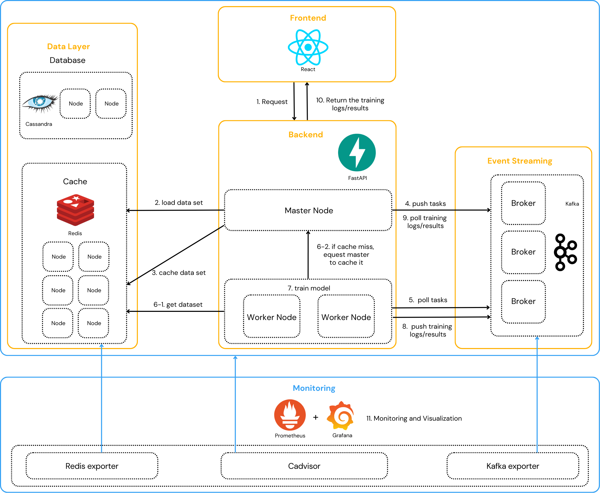

# Distributed Machine Learning Training System with Monitoring

### Table of content
- [Distributed Machine Learning Training System with Monitoring](#distributed-machine-learning-training-system-with-monitoring)
    - [Table of content](#table-of-content)
    - [Detailed usage of each service](#detailed-usage-of-each-service)
  - [Overview](#overview)
  - [Architecture Introduction](#architecture-introduction)
  - [System Flow](#system-flow)
      - [Summary of Component Roles in the Flow](#summary-of-component-roles-in-the-flow)
  - [Setup: Running the System with docker-compose](#setup-running-the-system-with-docker-compose)
  - [Design Considerations](#design-considerations)
      - [Parallel Model Training for Scalability](#parallel-model-training-for-scalability)
      - [Real-time Feedback for Enhanced User Experience](#real-time-feedback-for-enhanced-user-experience)
      - [Optimized Data Management for Performance](#optimized-data-management-for-performance)
      - [High Availability and Fault Tolerance Database](#high-availability-and-fault-tolerance-database)
      - [System Monitoring](#system-monitoring)
  - [Core Features](#core-features)
    - [Model Selection and Training Task Initiation](#model-selection-and-training-task-initiation)
    - [Task Coordination and Orchestration](#task-coordination-and-orchestration)
    - [Task Distribution and Real-time Logging](#task-distribution-and-real-time-logging)
    - [High Availability Data Storage](#high-availability-data-storage)
    - [Parallel Model Training:](#parallel-model-training)
    - [In-memory Caching Layer](#in-memory-caching-layer)
    - [System Monitoring and Visualization](#system-monitoring-and-visualization)
  - [Grafana Dashboards: Monitored Metrics](#grafana-dashboards-monitored-metrics)
      - [Prometheus Configuration Overview](#prometheus-configuration-overview)
      - [Dashboard: Docker Containers Overview](#dashboard-docker-containers-overview)
      - [Dashboard: Kafka Exporter Overview](#dashboard-kafka-exporter-overview)
  - [Ports and Service Access](#ports-and-service-access)
  - [API Endpoints and Workflow](#api-endpoints-and-workflow)


### Detailed usage of each service
- [Cassandra Usage in this System: Architecture and Best Practices](docs/Cassandra.md)
- [Kafka Usage in this System: Architecture and Best Practices](docs/kafka.md)
- [Redis Usage in this System: Architecture and Best Practices](docs/Redis.md)


---

## Overview


This platform provides parallel machine learning training services with real-time feedback. It focuses on training deep learning models on the MNIST dataset using three common architectures: MLP, CNN, and LSTM. The system distributes workloads across multiple worker nodes and streams real-time logs to the frontend, offering users immediate insight into the training process.


## Architecture Introduction

This parallel training platform leverages Cassandra for scalable data storage, Redis for fast caching, and Kafka for real-time monitoring. The system ensures fault tolerance through replication and scalability via distributed worker nodes. With real-time feedback through SSE and continuous monitoring using Prometheus and Grafana, the platform offers a seamless user experience. This architecture is optimized to handle large-scale, parallel machine learning tasks efficiently, making it reliable, scalable, and user-friendly.

---
## System Flow

This section outlines the detailed flow of the entire machine learning training system. The diagram below showcases the interaction between components for data loading, task distribution, model training, caching, and monitoring.




1. **Frontend Request**
   - The user sends a request through the **React frontend** interface, selecting a model (MLP, CNN, LSTM) and starting the training process.

2. **Data Loading to Cassandra**
   - The **Master Node** download Minst dataset to Cassandra.

3. **Cache Data in Redis**
   - The retrieved dataset is cached in **Redis** for quick access during the training process, reducing future read latency.

4. **Task Assignment**
   - The **Master Node** publishes tasks to **Kafka brokers**, where each task is pushed to specific Kafka topics for worker nodes to consume.

5. **Polling Tasks from Kafka**
   - **Worker Nodes** poll the relevant Kafka topics to fetch assigned tasks asynchronously.

6. **Retrieve Dataset from Redis**
   - Worker nodes first attempt to retrieve the required dataset from **Redis**. If unavailable, they request master node to cache it in redis from Cassandra.

7. **Training Models on Worker Nodes**
   - Worker nodes train the requested models in parallel using **TensorFlow**.
   - Trained models and intermediate results are pushed back to **Kafka** for real-time feedback.

8. **Real-Time Feedback via Kafka**
   - Training progress and logs are continuously pushed to Kafka and made available for **frontend** consumption via Server-Sent Events (SSE).

9. **Polling Results from Kafka**
   - The **Frontend** polls the Kafka topics to receive real-time logs and final results of the training process.

10. **Return Training Results**
    - Once the training is complete, the **Frontend** displays the results to the user, providing feedback on the model's performance.

11. **Monitoring and Visualization**
    - All components expose `/metrics` endpoints monitored by **Prometheus**.
    - Metrics are visualized using **Grafana**, providing system health information and alerts for resource spikes or failures.


#### Summary of Component Roles in the Flow

- **Frontend (React):** Sends requests and receives real-time logs and training results.
- **Master Node (FastAPI):** Handles coordination, stores metadata, and pushes tasks to Kafka.
- **Kafka:** Manages task distribution and real-time log streaming between the backend and worker nodes.
- **Cassandra:** Stores datasets and metadata, ensuring high availability and scalability.
- **Redis:** Acts as a caching layer to reduce latency in data retrieval.
- **Worker Nodes (FastAPI + TensorFlow):** Perform model training tasks and push training log and results to Kafka.
- **Monitoring (Prometheus & Grafana):** Tracks performance metrics and visualizes system health.


This flow ensures scalability, real-time feedback, and fault tolerance, allowing multiple worker nodes to operate in parallel while monitoring system health and resource usage effectively.

---


## Setup: Running the System with docker-compose

To deploy the entire machine learning platform, use the following command to build and start all services:

```bash
docker-compose up --build
```

This command ensures that each container is built from the specified Dockerfiles and started in the correct order, following the dependencies defined in the docker-compose.yml file.


## Design Considerations

This system is designed to address key scenarios:

#### Parallel Model Training for Scalability
 The platform distributes workloads across multiple worker nodes to handle large datasets and reduce training time.

#### Real-time Feedback for Enhanced User Experience
Kafka streams logs and updates in real-time to provide instant feedback to users via Server-Sent Events (SSE).

#### Optimized Data Management for Performance
 Redis caching reduces the load on Cassandra, ensuring faster data access and smoother user interactions.

#### High Availability and Fault Tolerance Database
 Cassandra's replication guarantees data availability, ensuring the system remains operational during node failures.

#### System Monitoring

Prometheus and Grafana monitor system health and resource usage, ensuring reliability and early detection of issues.

---
## Core Features


### Model Selection and Training Task Initiation
Provides a user-friendly interface built with React for deep learning model selection and real-time log viewing.
**Technology Stack:**   
**Functionality:**
- Users select models (MLP, CNN, LSTM) and initiate training.
- Real-time logs are streamed via SSE to keep users informed.


### Task Coordination and Orchestration
 The master node receives user requests, stores data in Cassandra, and distributes tasks to worker nodes through Kafka.
**Technology Stack:**   

**Process:**
- Receives user requests and stores dataset metadata in Cassandra.
- Publishes training tasks to Kafka topics for consumption by worker nodes.
  
**Best Practices:** 
- **Task Decoupling:** Use Kafka topics to decouple task coordination
-  **Asynchronous Processing:** Handle requests asynchronously in FastAPI 

### Task Distribution and Real-time Logging
Kafka handles task distribution between the master and worker nodes and provides real-time log streaming to the frontend.
**Technology Stack:** 

**Process:**
  - Tasks are published to Kafka topics for asynchronous consumption by worker nodes.
  - Training logs are streamed back to the frontend via SSE to provide real-time feedback.

**Best Practices:**
  - **Partitioning Strategy:** Use Kafka partitions to ensure parallel consumption by multiple worker nodes.
  - **Real-time Feedback:** Use Server-Sent Events (SSE) for continuous log streaming to keep users engaged.


### High Availability Data Storage
 Cassandra stores datasets and metadata, ensuring fast read and write operations for training tasks.

**Technology Stack:** 

**Process:**
  - Datasets are chunked into 5MB pieces, compressed, and stored.
  - Metadata is maintained to facilitate efficient data retrieval.
  
**Best Practices:**
  - **Replication for Availability:** Use a replication factor of 2 to ensure data availability even during node failures.
  - **Consistency Level Configuration:** Use LOCAL_QUORUM for a balance between performance and consistency.
  - **Compression for Efficiency:** Store datasets in compressed 5MB chunks to improve storage efficiency.

### Parallel Model Training:
Worker nodes retrieve tasks from Kafka, access data from Cassandra or Redis, and perform model training in parallel.
**Technology Stack:**    

**Process:**
  - Each worker node first attempts to fetch data from Redis. If the data is not available, it reads from Cassandra and caches the data in Redis.
  - Trained models and results are sent back to Kafka for real-time monitoring.

**Best Practices:**
  - **Parallelism and Load Distribution:** Distribute tasks across multiple worker nodes to maximize training throughput.
  - **Caching for Performance:** Use Redis caching to reduce repeated access to Cassandra and improve performance.
  - **Real-time Monitoring:** Send periodic updates during training to Kafka to track task progress.

### In-memory Caching Layer
Redis stores frequently accessed datasets, reducing the load on Cassandra and improving data retrieval times.
**Technology Stack:** 

**Process:**
  - Redis caches datasets for fast access during model training.
  - LRU eviction policy ensures optimal memory usage.

**Best Practices:**
- **Caching of Datasets:** Redis serves as an in-memory cache for datasets (e.g., MNIST) used during model training, avoiding repeated access to Cassandra and improving performance.

### System Monitoring and Visualization
Prometheus collects system metrics, and Grafana visualizes resource usage and training progress.
**Technology Stack:**  

**Process:**
  - Nodes expose `/metrics` endpoints for Prometheus to gather performance data.
  - Grafana displays metrics and triggers alerts for any potential bottlenecks or failures.

**Best Practices:**
  - **Alerting and Thresholds**: Set alerts in Grafana for critical system metrics such as CPU or memory spikes.
---
## Grafana Dashboards: Monitored Metrics

This section provides an overview of the **Grafana Dashboards** used in the system, detailing each monitored metric, its purpose, and common use cases. Monitoring ensures that the platform operates smoothly by tracking system health, resource usage, and performance bottlenecks.

#### Prometheus Configuration Overview

In this machine learning platform, Prometheus gathers system metrics from multiple nodes, while Grafana visualizes the collected data and offers dashboards to track the system's health, performance.

| **Target**                    | **Port** | **Description**                                           |
|-------------------------------|----------|-----------------------------------------------------------|
| **Kafka Exporter**             | 9308     | Monitors Kafka broker status, messages per second, and consumer group lags. |
| **Redis Exporter**             | 9121     | Tracks Redis memory usage, hit/miss ratios, and cache performance. |
| **Docker Containers (cAdvisor)** | 8080   | Monitors container-level CPU, memory usage, and network I/O. |


#### Dashboard: Docker Containers Overview

| **Metric**                  | **Description**                                      | **Common Use Case**                                      |
|-----------------------------|------------------------------------------------------|----------------------------------------------------------|
| **CPU Usage**               | Measures CPU usage per container                     | Detect bottlenecks in compute-intensive processes.       |
| **Memory Usage**            | Tracks memory usage by each container                | Prevent memory leaks and optimize memory allocation.     |
| **Running Containers**      | Monitors the number of active containers             | Ensure all critical services are running as expected.    |
| **Total Memory Usage**      | Displays the sum of memory used across containers    | Track system-wide memory consumption.                    |
| **Total CPU Usage**         | Displays total CPU usage for the system              | Detect overall system load and prevent CPU throttling.   |


#### Dashboard: Kafka Exporter Overview

| **Metric**                     | **Description**                                            | **Common Use Case**                                      |
|--------------------------------|------------------------------------------------------------|----------------------------------------------------------|
| **Messages per Minute**        | Tracks messages processed per minute                      | Monitor Kafka broker’s message flow trends and identify peak message throughput.                |
| **Lag by Consumer Group**      | Measures the difference between produced and consumed messages | Detect delays in message consumption.              |
| **Message Consume per Minute** | Tracks the number of consumed messages per minute         | Ensure consumers keep up with producers.                 |
| **Partitions per Topic**       | Displays the number of partitions assigned to each topic  | Monitor partition distribution across topics.            |
| **Offset Commit Rate**         | Measures the rate at which consumer offsets are committed | Monitor the efficiency of consumer offset commits.       |
| **Consumer Lag**               | Tracks the difference between the latest produced message and the latest consumed message | Identify consumer lag and potential bottlenecks. |

 **Dashboard: Redis Exporter Overview**


| **Metric**                      | **Description**                                      | **Common Use Case**                                        |
|----------------------------------|------------------------------------------------------|------------------------------------------------------------|
| **Total Memory Usage**           | Tracks Redis memory usage over time.                | Detect memory leaks and optimize cache size.               |
| **Commands Executed per Second** | Number of Redis commands processed per second.      | Monitor Redis throughput and detect spikes.                |
| **Network I/O (Sent/Received)**  | Measures incoming and outgoing Redis traffic.       | Detect unusual network traffic or bottlenecks.             |
| **Cache Hits/Misses per Second** | Monitors the number of cache hits and misses.       | Ensure high cache efficiency and optimize Redis usage.     |
| **Connected Clients**            | Tracks the number of active Redis clients.          | Ensure Redis is not overloaded by too many connections.    |
| **Expiring vs Non-expiring Keys**| Compares expiring and non-expiring keys.            | Ensure proper cache expiration policies are in place.      |
| **Uptime**                       | Measures how long the Redis server has been running.| Track server stability and ensure uptime.                  |
| **Total Items per DB**           | Monitors the number of keys stored in each Redis DB.| Track and manage data usage across Redis databases.        |
| **Expired/Evicted Keys**         | Tracks the number of keys that expired or were evicted.| Ensure the eviction policy is working as expected.   |
| **Commands Call per Second**     | Shows the rate of specific command calls.           | Identify high-frequency Redis commands for optimization.   |
| **Commands Executed / sec**      | Total Redis commands executed per second.           | Monitor performance trends and detect spikes in load.      |


This comprehensive **Grafana Dashboard** setup ensures complete visibility into the system’s performance. By monitoring key metrics across Redis, Kafka, Prometheus, and Docker containers, the system can proactively address issues, optimize resource usage, and provide a seamless user experience.

---
## Ports and Service Access
Once the system is up, you can access the various services through the following ports:

- Frontend: http://localhost:3001
  - User interface for selecting models and viewing real-time logs.
- Master Node: http://localhost:5000/docs
  - REST API for task management and data coordination.
- Worker Node 1: http://localhost:8000/docs
  - API to monitor individual worker status.
- Worker Node 2: http://localhost:9001/docs
  - API to monitor individual worker status.
- Kafka Management (Kafdrop): http://localhost:9000
  - Monitor Kafka topics and messages.
- Prometheus: http://localhost:9090
  - Monitor system metrics and alerts.
- Grafana: http://localhost:3000
  - Visualize metrics and dashboards.
- Redis: Exposed at localhost:6379 (no web interface).
- Kafka Brokers: Exposed at localhost:6379 (no web interface).
  - Kafka Broker 1: localhost:9092
  - Kafka Broker 2: localhost:9093
  - Kafka Broker 3: localhost:9094
- Cassandra Nodes:
  - Node 1: localhost:9042
  - Node 2: localhost:9142
- Redis Exporter: http://localhost:9121
  - Monitor Redis metrics.
- Kafka Exporter: http://localhost:9308
  - Monitor Kafka metrics.
- cAdvisor: http://localhost:8080
  - Monitor container resource usage.

---
## API Endpoints and Workflow

Here are the core API endpoints exposed by the master and worker nodes:

**Logs and Status**

```GET /logs/stream``` 
- Streams real-time logs from Kafka to the frontend.

```GET /kafka-status```
- Returns the status of Kafka brokers to ensure connectivity.

**Task Management**

```POST /send_task/{task_type}```
- Sends a training task of the specified type (MLP, CNN, LSTM) to Kafka.

```GET /test-producer```
- Tests the Kafka producer by sending a dummy message.

**Data Management**

```POST /store_mnist_dataset_to_cassandra```
- Stores the MNIST dataset in Cassandra.

```GET /store_data_from_cassandra_to_redis```
- Fetches MNIST data from Cassandra, caches it in Redis, and returns the result.

**Health Check**

```GET /health```
- Checks the health status of the master node.